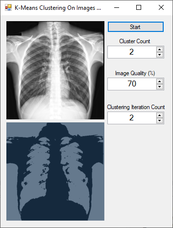
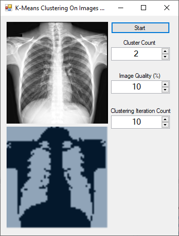

# K-Means Clustering On Images With C#

In this project, K-Means Clustering algorithm has been applied to the images. The applied algorithm clumps the pixels according to the distance of the color values of the pixels in the image.

Coded by **[hayrilatifyilmaz](https://github.com/hayrilatifyilmaz)**
